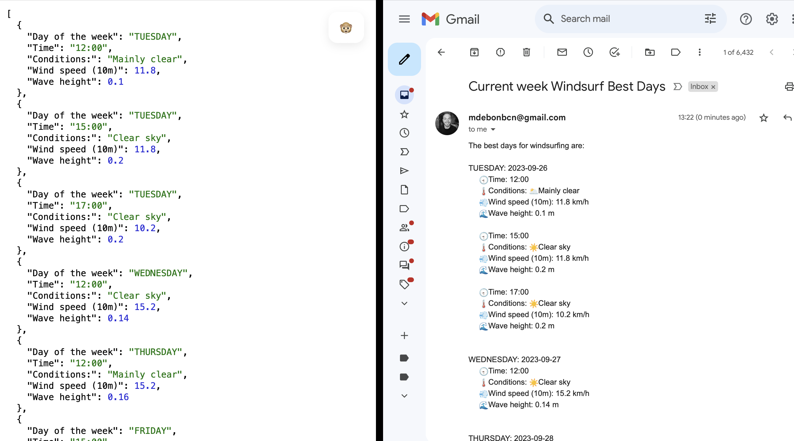

## Windsurf Weather API

This API tell you the best day/hour to do windsurf + **SEND MAIL**


The code get the data from **[open-meteo.com](https://open-meteo.com/en/docs/marine-weather-api#latitude=41.3888&longitude=2.159&start_date=2023-09-23&end_date=2023-09-28)**, 
filter this data to remove the bad weather and retrieve the best options.

### Good weather?
- Wave: 0 - 0,6 m
- Wind: 12-27 km/h
- WeatherCode: Sunny, mainly Clear, partly cloudy, overcast

🛜You can try the current API here deployed in AWS:
http://35.180.87.109/weather/current_week

Receive it in your mail:
http://35.180.87.109/weather/current_week/{mail}

```
    http://localhost:8080/weather/current_week              ->      Best days in Barcelona this week
    http://localhost:8080/weather/next_week                 ->      Best days in Barcelona next week
    http://localhost:8080/weather/current_week/{mail}       ->      It emails you the best days in Barcelona this week
    http://localhost:8080/weather/next_week/{mail}          ->      It emails you the best days in Barcelona next week
   
    *The schedule has been restricted to 12:00, 15:00, 17:00 which are the classes time
    **If the data for next_week doesn't work means there isn't the data yet in the original API
```
```
[
  {
    "Day of the week": "TUESDAY",
    "Time": "15:00",
    "Conditions:": "Clear sky",
    "Wind speed (10m)": 10.8,
    "Wave height": 0.2
  },
  {
    "Day of the week": "WEDNESDAY",
    "Time": "12:00",
    "Conditions:": "Clear sky",
    "Wind speed (10m)": 15.2,
    "Wave height": 0.14
  }
]
```
### Get your email 📫!



<hr>

#### Why this API?
Last summer, I joined a center to learn windsurfing. What happens is that they offer a package of 10 classes, and every Friday, they provide the schedule for the following week, and you must choose wisely. 

**You want wind but not waves, and at the same time, a sunny day**, so these three parameters can make it tricky sometimes to decide, but in the end, it's all about mathematics.
<hr>


**FunFact WMO Weather interpretation codes (WW)**
```
Code	    Description
0           Clear sky
1, 2, 3	    Mainly clear, partly cloudy, and overcast
45, 48	    Fog and depositing rime fog
51, 53, 55  Drizzle: Light, moderate, and dense intensity
56, 57	    Freezing Drizzle: Light and dense intensity
61, 63, 65  Rain: Slight, moderate and heavy intensity
66, 67	    Freezing Rain: Light and heavy intensity
71, 73, 75  Snow fall: Slight, moderate, and heavy intensity
77          Snow grains
80, 81, 82  Rain showers: Slight, moderate, and violent
85, 86	    Snow showers slight and heavy
95 *	    Thunderstorm: Slight or moderate
96, 99 *    Thunderstorm with slight and heavy hail
(*)         Thunderstorm forecast with hail is only available in Central Europe
```